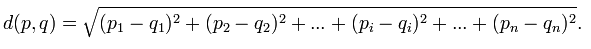
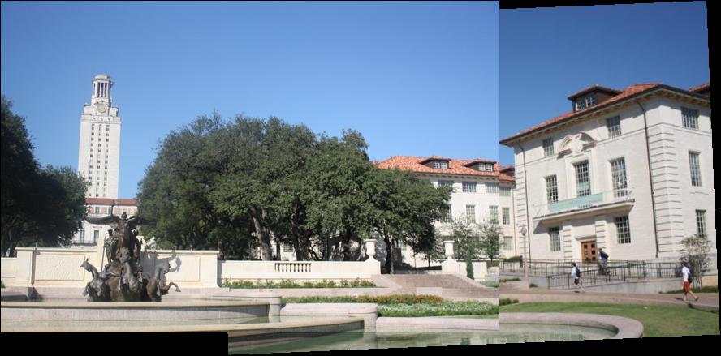

# 張植鈞 <span style="color:red">(student ID: 102061214)</span>

# Project 2 / Panorama Stitching

## Overview

The goal of this project is to implement panorama stitching in Matlab. We will find SIFT keypoints from multiple images and then match them to build a single panoramic image. 

## Implementation

1.Matching SIFT Descriptors(SIFTSimpleMatcher.m)

We use Euclidean distance to calculate the similarity between two features in two image.

Euclidean distance:



In addition, we give a threshold to distinguish the paired keypoints from other ketpoints. If the smallest Euclidean distance is less than threshold x the next smallest, we say that the two vectors are a match.

```
for i = 1:N1
    for j = 1:N2
       Euclidean_distance = pdist([descriptor1(i,:); descriptor2(j, :)], 'euclidean');
       buf(j) = Euclidean_distance;
    end
    [min1, idx1] = min(buf);
    buf(idx1) = inf;
    [min2, idx2] = min(buf);
    if (min1 < (thresh*min2))
        match = [match; [i, idx1]];
    end
end
```

2.Fitting the Transformation Matrix(ComputeAffineMatrix.m)

We now have a list of matched keypoints across the two images. Then, we need to to find a transformation matrix that maps an image 1 point to the corresponding coordinates in image 2. In other words, this transformation matrix satisfies
```p1 * H' = p2```. In Malab, the form Ax=b, x can be solved by and A\b.

```
H_ = P1'\P2';
H = H_';
```



3.RANSAC(RANSACFit.m)

Use RANSAC(RANdom SAmple Consensus) to find a robust affine transformation, and then we can get a more robust estimation of affine transformation from p1 to p2. We have to use ```ComputeError()``` function in RANSACFit.m to find the Euclidean distance between Hp1 and p2, so we can get the more reliable pairs.

```
for m=1:size(match,1)
    pt1To2(m,:) = pt1(match(m,1),:)*H';
    pt2_match(m,:) = pt2(match(m,2),:);
end
dists = sqrt(sum((pt1To2-pt2_match()).^2,2));
```

4.Stitching Ordered Sequence of Images(MultipleStitch.m)

We choose the middle image as the reference image, and the outputed panorama is in the same coordinate system as the reference image. We need a transformation matrix that will convert points in frame i to frame ref. If the current frame index is smaller than referent frame index, we can just continuedly multiply the transformation matrix. However, if the current frame index is smaller than referent frame index, we have to calculate the previous transfromation matrix by multiply the inverse of current transformation matrix.

```
if currentFrameIndex < refFrameIndex
    for n = currentFrameIndex:refFrameIndex-1
        T = i_To_iPlusOne_Transform{n}*T;
    end
else
    for n = (currentFrameIndex-1):-1:refFrameIndex
        T = pinv(i_To_iPlusOne_Transform{n})*T;
    end 
end
```

## Installation
* How to compile from source?

Compile & Run StitchTesterin.m Matlab

* Usage: 

match = SIFTSimpleMatcher(descriptor1, descriptor2, thresh)

H = ComputeAffineMatrix( Pt1, Pt2 )

H = RANSACFit(p1, p2, match, maxIter, seedSetSize, maxInlierError, goodFitThresh )

Pano = MultipleStitch( IMAGES, TRANS, fileName )

### Results


